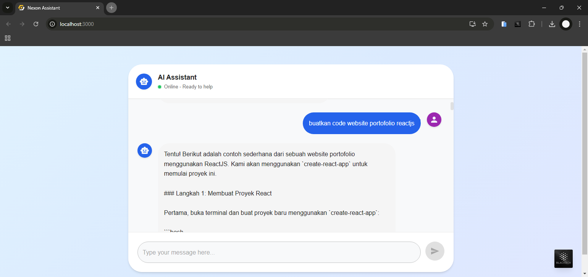

# AI Chat

A modern React-based chat application that integrates with an AI API for intelligent conversations.



## Features

- 🤖 Real-time AI responses
- 💬 Modern chat interface
- 🎨 Material-UI components
- ⚡ Fast and responsive
- 📱 Mobile-friendly design

## Installation Guide

### Prerequisites

Before installing the application, make sure you have the following installed on your system:

1. Node.js (version 14.0.0 or higher)
2. npm (usually comes with Node.js)
3. Git (for cloning the repository)

### Step-by-Step Installation

1. **Clone the Repository**
   ```bash
   git clone https://github.com/slightnich/chatAI-ReactJS.git
   cd ai-chat-app
   ```

2. **Environment Setup**
   ```bash
   # Copy the example environment file
   cp .env.example .env
   
   # Open .env and configure your environment variables
   # Make sure to set your API keys and other required variables
   ```

3. **Install Dependencies**
   ```bash
   npm install
   ```

4. **Start Development Server**
   ```bash
   npm start
   ```
   The application will be available at `http://localhost:3000`

## API Configuration

This application uses the Nexon AI API for chat functionality. Follow these steps to configure the API:

1. **Get API Access**
   - Visit https://api.nexon.my.id to get your API credentials
   - Sign up for an account if you haven't already

2. **Configure API in Environment**
   - Open your `.env` file
   - Add your API configuration:
     ```env
     REACT_APP_API_URL=https://api.nexon.my.id
     REACT_APP_API_KEY=your_api_key_here
     ```

3. **API Endpoints**
   The application uses the following endpoints:
   - Chat completion: `https://api.nexon.my.id/api/chat-gpt`

4. **Rate Limits**
   Please refer to the API documentation at https://api.nexon.my.id for current rate limits and usage guidelines.

5. **Build for Production** (Optional)
   ```bash
   npm run build
   ```
   This will create an optimized production build in the `build` folder

### Troubleshooting

If you encounter any issues during installation:

1. Make sure all prerequisites are properly installed
2. Check if all environment variables are correctly set in `.env`
3. Try deleting `node_modules` and `package-lock.json`, then run `npm install` again
4. Ensure you have the correct Node.js version

## Required Dependencies

This project uses the following main dependencies:

```json
{
  "dependencies": {
    "@emotion/react": "^11.14.0",
    "@emotion/styled": "^11.14.0",
    "@mui/icons-material": "^6.4.1",
    "@mui/material": "^6.4.1",
    "axios": "^1.7.9",
    "react": "^19.0.0",
    "react-dom": "^19.0.0"
  }
}
```

To install all dependencies at once, run:

```bash
npm install @emotion/react@11.14.0 @emotion/styled@11.14.0 @mui/icons-material@6.4.1 @mui/material@6.4.1 axios@1.7.9 react@19.0.0 react-dom@19.0.0
```

## Code Blocks

### Main Chat Component

```jsx
// src/components/Chat.js
import React, { useState } from 'react';
import { Box, TextField, Button, Paper, Typography, Container, Avatar, IconButton, CircularProgress } from '@mui/material';
import SendIcon from '@mui/icons-material/Send';
import SmartToyIcon from '@mui/icons-material/SmartToy';
import PersonIcon from '@mui/icons-material/Person';
import axios from 'axios';

const Chat = () => {
  const [messages, setMessages] = useState([]);
  const [input, setInput] = useState('');
  const [isLoading, setIsLoading] = useState(false);

  const handleSend = async () => {
    if (!input.trim()) return;

    const userMessage = { text: input, sender: 'user' };
    setMessages([...messages, userMessage]);
    setIsLoading(true);

    try {
      const response = await axios.get(`https://api.nexon.my.id/api/chat-gpt`, {
        params: {
          q: input,
          apikey: 'your_api_key'
        }
      });

      if (response.data && response.data.data) {
        const aiMessage = { text: response.data.data, sender: 'ai' };
        setMessages(prevMessages => [...prevMessages, aiMessage]);
      } else {
        const errorMessage = { text: "Maaf, terjadi kesalahan dalam memproses pesan.", sender: 'ai' };
        setMessages(prevMessages => [...prevMessages, errorMessage]);
      }
    } catch (error) {
      console.error('Error:', error);
      const errorMessage = { text: "Maaf, terjadi kesalahan dalam menghubungi server.", sender: 'ai' };
      setMessages(prevMessages => [...prevMessages, errorMessage]);
    } finally {
      setIsLoading(false);
      setInput('');
    }
  };

  // ... rest of the component code
};

export default Chat;
```

## Running the Application

1. Make sure all dependencies are installed:
```bash
npm install
```

2. Start the development server:
```bash
npm start
```

3. Open your browser and navigate to:
```
http://localhost:3000
```

## Automatic Installation Script

Create a file named `install.bat` in your project root with the following content:

```batch
@echo off
echo Installing AI Chat App dependencies...
npm install

echo Starting the development server...
npm start
```

To use the automatic installation script:
1. Save the above content in a file named `install.bat`
2. Double-click the `install.bat` file
3. Wait for the installation to complete and the development server to start

## Troubleshooting

If you encounter any issues:

1. Clear node_modules and reinstall:
```bash
rm -rf node_modules
npm install
```

2. Clear npm cache:
```bash
npm cache clean --force
```

3. Make sure you're using a compatible Node.js version:
```bash
node -v  # Should be v16 or higher
```

## Connect With Me

Feel free to connect with me on various social media platforms:

- 🌐 Website: [nexon.my.id](https://nexon.my.id)
- 📱 Instagram: [@nexon.my.id](https://instagram.com/itsmyransyah)
- 🐙 GitHub: [@slightnich](https://github.com/slightnich)
- 📧 Email: [admin@nexon.my.id](mailto:admin@nexon.my.id)

## License and Copyright

 2025 Kens Ransyah. All Rights Reserved.

This project and its contents are protected under applicable copyright laws. Any use, modification, or distribution of this code must maintain this copyright notice and adhere to the terms set by the copyright holder.
